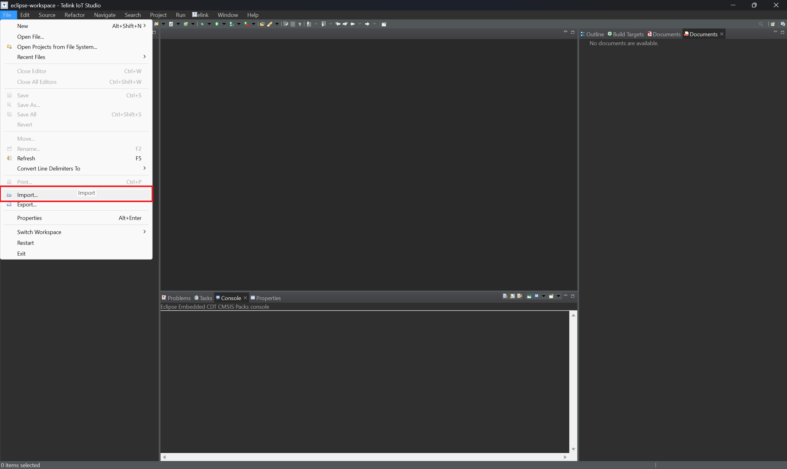
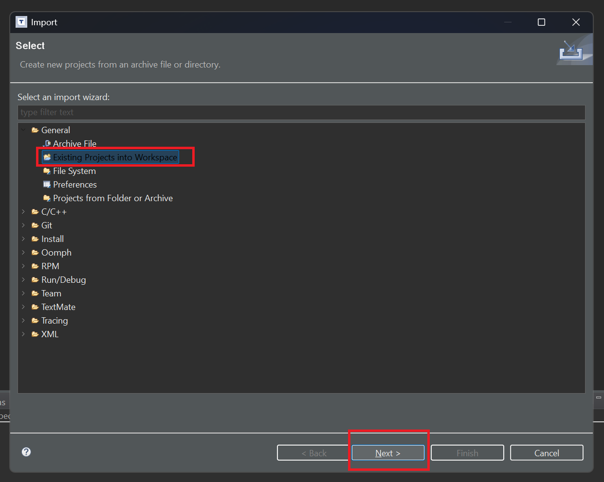
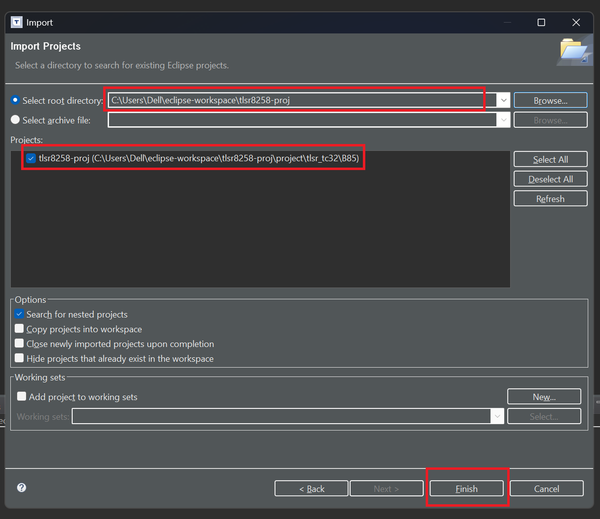
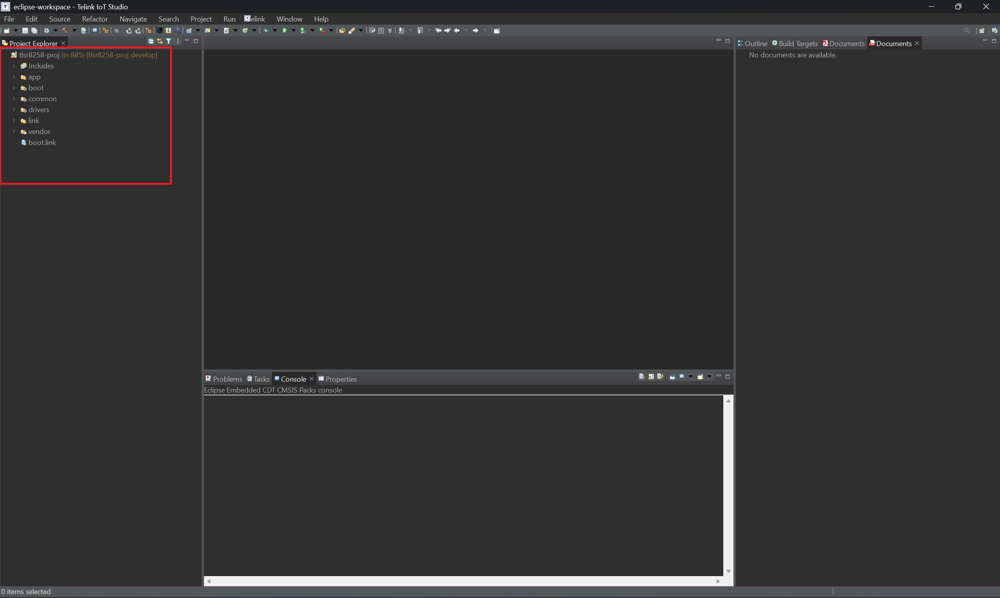
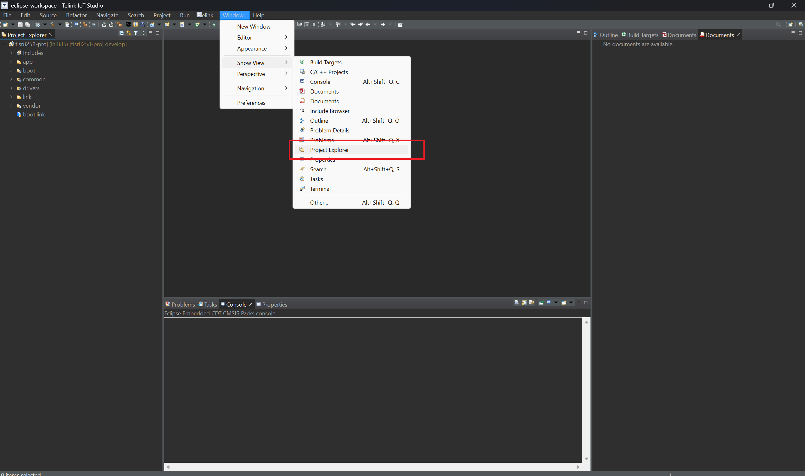
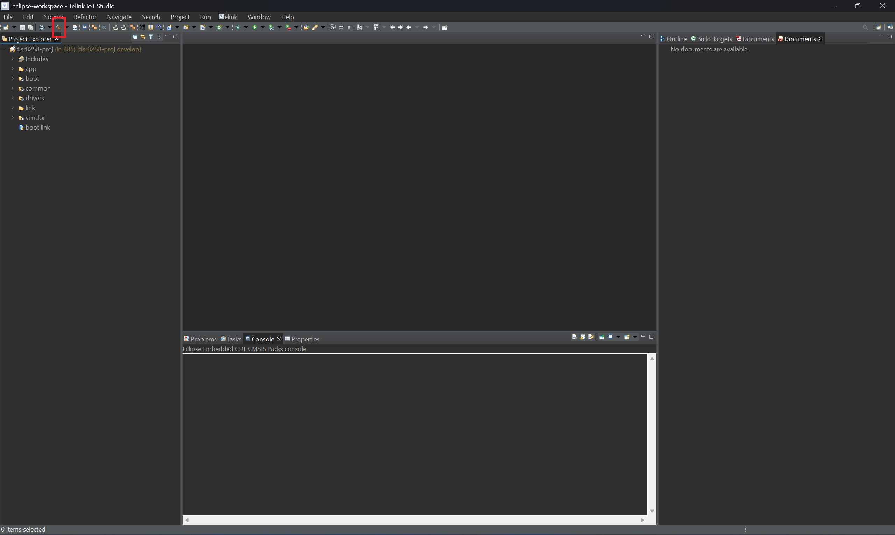
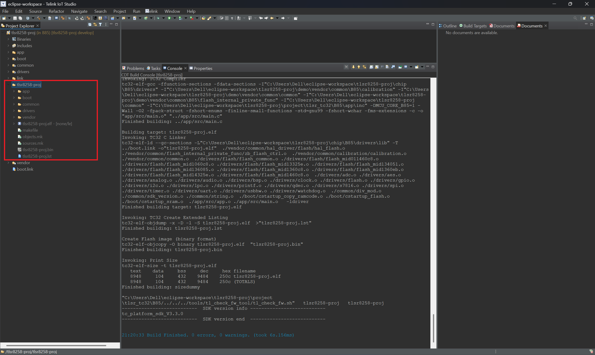

# TLSR8258-PROJ

This is a repository that serves as a starting point to develop a new application based on the MCU **TLSR8258** from Telink. The repository contains a template project based on **TLSR8258DK48** development board, which is powered with the **TLSR8258F512ET48** microncontroller. The template project is the usual _Hello World_ for embedded systems, i.e.: a Blink LED example

## Environment

By the time this template project was developed, the following tools/software were used:

- **Telink IoT Studio V2025.2** - This is the IDE used to develop IoT applications for MCUs from Telink. Latest version can be downloaded from Telink's website:
    - [Download Telink IoT Studio (Windows)](https://doc.telink-semi.cn/tools/telink_iot_studio/TelinkIoTStudio_V2025.2.zip)
    - [Download Telink IoT Studio (Linux)](https://doc.telink-semi.cn/tools/telink_iot_studio/Telink_IoT_Studio_2025.2_Installer.run)
- **tc32-elf-gcc version 4.5.1-tc32-1.3** - Compiler used to build the code, installed together with Telink IoT Studio 2025.2
- **tc_platform_sdk-3.3.0** - This is the SDK (_Software Development Kit_) provided from Telink to be used with a variety of chips, including the TLSR8258. The SDK contains drivers to access peripherals, MCU clock configuration and runtime initialization, so the developer can really focus on the application. The template project uses this SDK as a starting point and keeps its original structure, so it is easier to bring any SDK updates from Telink in the future. One does not need to get the standalone SDK in order to use the template provided by this repository, but it can be cloned or downloaded:
    - [SDK repository](https://github.com/telink-semi/tc_platform_sdk)
    - [SDK single zip (V3.3.0)](https://github.com/telink-semi/tc_platform_sdk/archive/refs/tags/V3.3.0.zip)

## Building the project

1. Clone this repository. 
2. After launching Telink IoT Studio, go to _File_ --> _Import_

3. In _General_, select _Existing Projects into Workspace_ and click on _Next_

4. Specify the path as the path where this repository was cloned, select the project to be imported and click on _Finish_

5. After importing the project, the folder structure will appear on the left-side pannel

6. If the folder structure does not appear, just select the _Project Explorer_ view to be shown. Click on _Window_ --> _Show View_ --> _Project Explorer_

7. Once everything is setup, just click on the _Build_ icon (the hammer) to build the project. This project has just one Build Configuration

8. After a successful build, one should obtain the following output

The binaries will be found inside a folder with the same name of the project. If the binaries are not being shown, just click on the folder and hit F5 to do a refresh.

**NOTE:** All the steps above were executed on a PC running Windows 11 for example purposes, but it should work on a PC running Linux, as Telink IoT Studio can be installed on Linux

## Download firmware on target MCU

The binary file generated through the building process can be downloaded on the target MCU using the BDT - _Burning and Debugging Tool_. The latest version of the BDT can be downloaded from Telink's website:
- [Download BDT (Windows)](https://doc.telink-semi.cn/tools/bdt/BDT_v5.8.5.zip)
- [Download BDT (Linux)](https://doc.telink-semi.cn/tools/bdt/Telink-BDT-Linux-X64-2.1.0.zip)

Also, there is a complete tutorial made by Telink on how to use BDT to download firmware on target device:
- [BDT Tutorial (Windows)](https://doc.telink-semi.cn/doc/en/software/res/tools/bdt_wins/bdt_wins_en/)
- [BDT Tutorial (Linux)](https://doc.telink-semi.cn/doc/en/software/res/tools/bdt_linux_mac/bdt_linux_mac_en/)